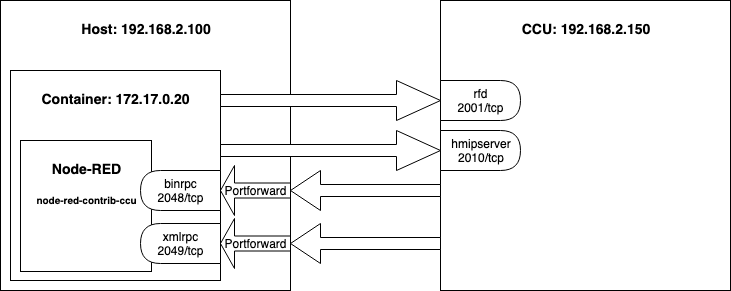
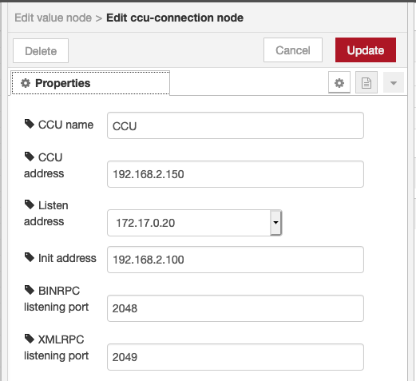
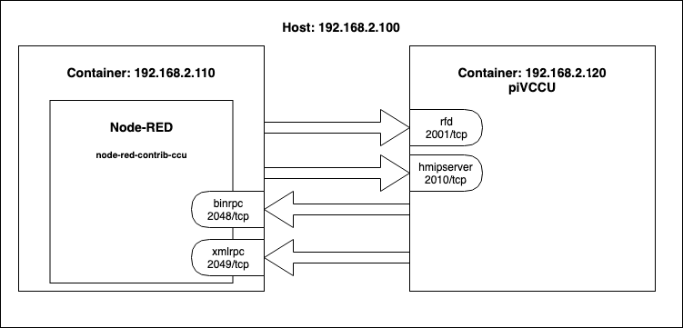
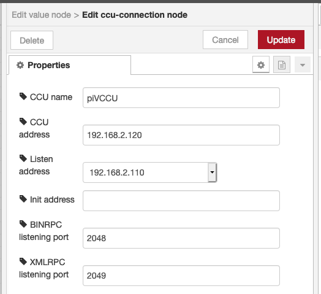
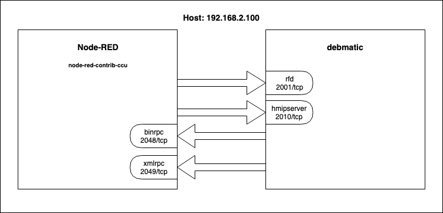
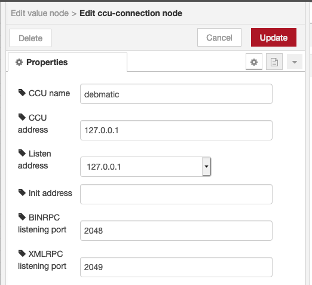

# node-red-contrib-ccu

[![License][mit-badge]][mit-url]

> Node-RED Nodes for the Homematic CCU

With these Nodes you can connect [Homematic](https://github.com/hobbyquaker/awesome-homematic) and 
[Node-RED](https://nodered.org/). Homematic is a series of smart home automation hardware from the manufacturer 
[eQ-3](http://www.eq-3.de/), popular especially in Germany.

**⚠️ node-red-contrib-ccu >= 3.0 needs Node-RED >= 1.0.** If you're still on Node-RED 0.20 or lower you should use the 
latest 2.x version of node-red-contrib-ccu.

For the communication with the CCU both RPC and ReGaHSS remote script are used. It's possible to connect to multiple 
CCUs from one Node-RED instance. RPC setValue calls can be comfortably complemented with ON_TIME and RAMP_TIME values
and special nodes ease the control of displays and mp3 actuators. RPC events can be filtered comprehensively (even 
through regular expressions and also by rooms and functions). It's possible to start rega-programs and set 
rega-variables and last but not least there are nodes to execute arbitrary rega-scripts and RPC calls.

These nodes are included in [RedMatic](https://github.com/rdmtc/RedMatic) which ships Node-RED as an addon package 
for installation on a Homematic CCU3 or RaspberryMatic.

Some example flows can be found in the [RedMatic Wiki](https://github.com/rdmtc/RedMatic/wiki) (German language).

__A modern Browser is required, Internet Explorer won't work.__

__Starting with Version 3.x these Nodes need Node-RED >= 1.0 to work correctly__

## Configuration Examples

The communication with the Homematic CCU needs independent connections in two directions. Node-red-contrib-ccu connects to the CCU's interface listeners (e.g. 2001/TCP for BidCos-RF) while the CCU connects to node-red-contrib-ccu's BINRPC/XMLRPC listeners (2048/tcp and 2049/tcp in examples below).

### NAT'd network

If Node-RED/node-red-contrib-ccu runs inside a Container or a VM with NAT'd network it's necessary to forward/expose the ports for connections _from_ the CCU _to_ node-red-contrib-ccu's callback listeners (example below for a Docker container: use options `-p 2048:2048 -p 2049:2049`in the docker run command). 

The config option `Init address`will be used to tell the CCU on which Address node-red-contrib-ccu is reachable. As 172.17.0.20 is not reachable for the CCU the Hosts IP Address and port forwarding/exposal has to be used. As `Listen address` setting also `0.0.0.0` (which tells node-red-contrib-ccu to bind it's listeners to all available interfaces) would be possible. 

### piVCCU

This example shows a configuration for piVCCU and Node-RED running in containers with bridged networking.

### debmatic

In this example both Node-RED and debmatic are installed on the same (possibly virtual) host.

### Multiple CCUs

With the same logic as shown above, multiple CCUs can be managed within one Node-RED instance.
This will require two individual configuration nodes, in which the respective connection setting are provided.

 - `Listen address` typically is the same for both Configurations as it is determined by the host that is running Node-RED
 - `BINRPC listening port` and `XMLRPC listening port` need to be different across the two configurations. One configuration can use the defaults (2048/tcp and 2049/tcp), the other needs to use two new ports. node-red-contrib-ccu will make a proposal, but this can be modified, e.g. if the proposed ports are already used.
 - The examples for [NAT'd network](#NAT'd-network), [piVCCU](#piVCCU) and [debmatic](#debmatic) will apply likewise for multiple CCUs. This means, for running Node-RED within a docker, all BINRPC and XMLRPC ports must be forwarded, e.g. `-p 2048:2048 -p 2049:2049 -p 2061:2061 -p 2062:2062`

## License

MIT (c) Sebastian Raff and node-red-contrib-ccu contributors

[mit-badge]: https://img.shields.io/badge/License-MIT-blue.svg?style=flat
[mit-url]: LICENSE
