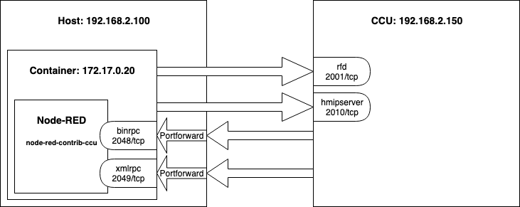
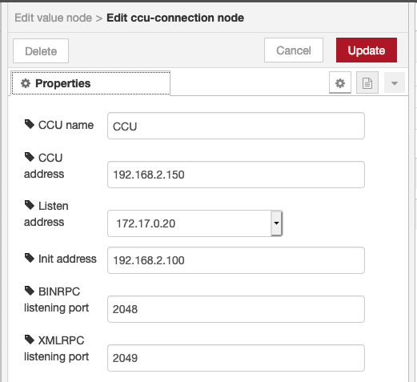
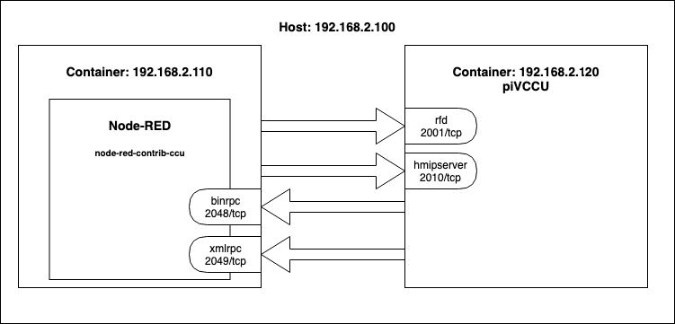
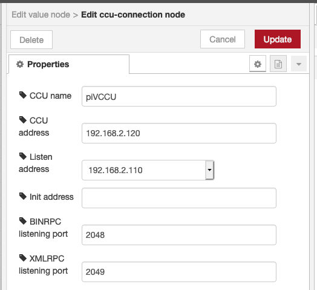
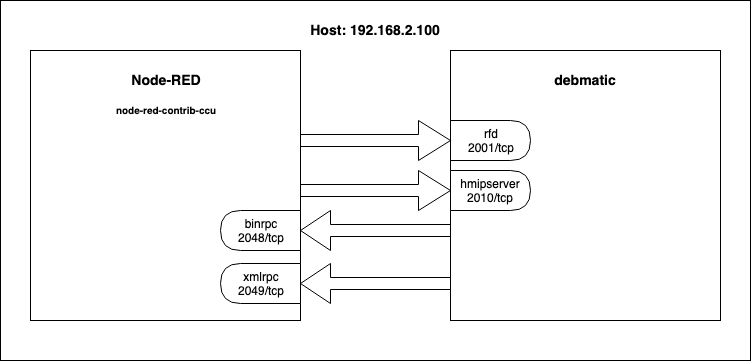
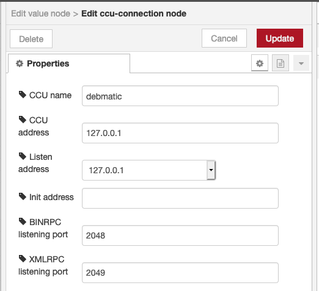
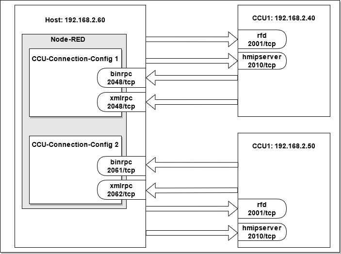

# node-red-contrib-ccu

[](https://www.npmjs.com/package/node-red-contrib-ccu)
[](https://github.com/rdmtc/node-red-contrib-ccu/actions/workflows/ci.yml)
[![License][mit-badge]][mit-url]

> Node-RED Nodes for the Homematic CCU

With these Nodes you can connect [Homematic](https://github.com/hobbyquaker/awesome-homematic) and
[Node-RED](https://nodered.org/). Homematic is a series of smart home automation hardware from the manufacturer
[eQ-3](http://www.eq-3.de/), popular especially in Germany.

**⚠️ node-red-contrib-ccu >= 4.0 needs Node-RED >= 4.0 and Node.js >= 20** (primary target: Node-RED 5 on Node 24).
On older Node-RED versions use the latest 3.x release of node-red-contrib-ccu.

For the communication with the CCU both RPC and ReGaHSS remote script are used. It's possible to connect to multiple
CCUs from one Node-RED instance. RPC setValue calls can be comfortably complemented with ON_TIME and RAMP_TIME values
and special nodes ease the control of displays and mp3 actuators. RPC events can be filtered comprehensively (even
through regular expressions and also by rooms and functions). It's possible to start rega-programs and set
rega-variables and last but not least there are nodes to execute arbitrary rega-scripts and RPC calls.

These nodes are included in [RedMatic](https://github.com/rdmtc/RedMatic) which ships Node-RED as an addon package
for installation on a Homematic CCU3 or RaspberryMatic.

Some example flows can be found in the [RedMatic Wiki](https://github.com/rdmtc/RedMatic/wiki) (German language).

**A modern Browser is required, Internet Explorer won't work.**

**Starting with Version 3.x these Nodes need Node-RED >= 1.0 to work correctly**

## openccu-lite

[openccu-lite](https://github.com/hobbyquaker/openccu-lite) is a Homematic CCU firmware **without ReGaHSS**. The
interface processes (`rfd`, `hs485d`, `hmipserver`) are the same, so everything these nodes do over BINRPC/XMLRPC works
unchanged — but there is no logic layer: nothing listens on 8181/8183, HM-Script is never interpreted, and there are no
ReGa ids. Device, channel, room and function names come from the box's metadata API instead.

Nothing has to be configured for this. When the connection node starts (and on every reconnect of its name sync) it
asks the box `GET /api/meta/v1/version`; a CCU3, RaspberryMatic or OpenCCU answers 404 and the ReGaHSS path runs exactly
as before, an openccu-lite answers with its API version and the node takes names, rooms and functions from there —
loaded once as a snapshot and then kept current from the box's event stream, so a rename in the box's UI shows up in
your flows within a second, without a redeploy. `msg.channelName`, `msg.rooms`, `msg.functions` and the room/function
filters keep exactly the shape they have on a CCU. The same connection node configuration works on both, which is what
makes moving a backup between the two harmless.

**Credential.** Every metadata endpoint except the version probe needs a token:

- Node-RED **on the box** (RedMatic): nothing to do — the box's own read-only token is read from
  `/usr/local/etc/occulite/local-token`.
- Node-RED **elsewhere** (a PC, a container): create a token on the box's _Users_ page and paste it into the
  **openccu-lite token** field of the connection node. The **openccu-lite port** field next to it is only needed when
  the box's web server is not on port 80 (443 with TLS).

Without a token the nodes still work, with addresses instead of names: the connection logs the rejected credential once
and picks the names up on the next retry, as soon as a valid token is there.

**What has no replacement on openccu-lite** (from openccu-lite's own porting guide):

- **System variables** and **programs**: there is no ReGa DOM. The `ccu-sysvar`, `ccu-program` and `ccu-poll` nodes stay
  in the palette and in your flows — they are accepted, they never break the connection, and every message they get is
  answered with a clear error instead.
- **`exec()` of HM-Script** — `dom.GetObject`, `system.GetSessionVarStr` and everything else the `ccu-script` node
  sends: gone, same handling as above.
- **ReGa ids** (`dom.GetObject(1234)`): there are none. The metadata API identifies objects by
  `<interface>.<address>`; these nodes have always keyed on the address, so nothing changes for flows.
- **Service messages / alarms** (system variables 40 and 41): interface-level state only.
- **The CCU WebUI's JSON-RPC API** (`/api/homematic.cgi`, `Session.login`, `Device.listAll`): not present.

Rooms and functions are a **tree** on openccu-lite (`room/eg/wohnzimmer`), not a flat list. They are flattened to the
arrays these nodes have always published, most specific first: a channel in _Wohnzimmer_ below _Erdgeschoss_ gets
`msg.rooms = ["Wohnzimmer", "Erdgeschoss"]` and `msg.room = "Wohnzimmer"`, so a room filter on either name matches.

## Home Assistant

The `ccu-homeassistant` node publishes
[MQTT discovery](https://www.home-assistant.io/integrations/mqtt/#mqtt-discovery) configurations (device-based,
Home Assistant >= 2024.11) for the devices you tick in its config dialog. It is a companion to the `ccu-mqtt` node:
it reuses that node's topic templates and payload format, so state and commands keep flowing through `ccu-mqtt` and
the discovery configs simply point Home Assistant at those topics. Wire both nodes to the same `mqtt out` node and
feed the `hm/set/#` topics from an `mqtt in` node into `ccu-mqtt` — see
[examples/home-assistant.json](examples/home-assistant.json). One Home Assistant device is created per Homematic
device with switch, light, cover, climate, binary_sensor, event, lock and sensor entities; every other datapoint can
optionally be included as a disabled-by-default entity. Unticking a device removes it from Home Assistant on the
next deploy.

## Dynamic configuration

Most nodes can be reconfigured per message: put an object in `msg.config` and its
properties override that node's own configuration **for that one message**. The stored
configuration is never modified, so the next message starts from the dialog settings
again — sending a different room, channel or brightness each time works as you would
expect.

```javascript
// one signal node, a different colour and duration per message
msg.config = {dimmerColor: 4, durationValue: 10};

// one set-value node, a different room per message
msg.config = {rooms: 'Kitchen'};
return msg;
```

Which keys a node accepts is listed in its help panel in the editor. Anything not on
that list is ignored, so an unrelated property in `msg.config` cannot reach node
internals. `msg.ccu` is not used for this because it already carries the CCU host name.

The `value`, `get value` and `set value` nodes additionally read plain top-level
properties (`msg.channel`, `msg.datapoint`, `msg.rooms`, …) to fill in fields left empty
in the dialog. That is the older mechanism and is unchanged; `msg.config` wins over it.

Inside a **subflow**, Node-RED substitutes `${PARAMETER}` placeholders in a node's text
fields before the node is created, so a subflow parameter can be typed straight into the
Channel or Datapoint field and each instance reads its own device.

## Configuration Examples

The communication with the Homematic CCU needs independent connections in two directions. Node-red-contrib-ccu connects to the CCU's interface listeners (e.g. 2001/TCP for BidCos-RF) while the CCU connects to node-red-contrib-ccu's BINRPC/XMLRPC listeners (2048/tcp and 2049/tcp in examples below).

### NAT'd network

If Node-RED/node-red-contrib-ccu runs inside a Container or a VM with NAT'd network it's necessary to forward/expose the ports for connections _from_ the CCU _to_ node-red-contrib-ccu's callback listeners (example below for a Docker container: use options `-p 2048:2048 -p 2049:2049`in the docker run command).





The config option `Init address`will be used to tell the CCU on which Address node-red-contrib-ccu is reachable. As 172.17.0.20 is not reachable for the CCU the Hosts IP Address and port forwarding/exposal has to be used. As `Listen address` setting also `0.0.0.0` (which tells node-red-contrib-ccu to bind it's listeners to all available interfaces) would be possible.

### piVCCU

This example shows a configuration for piVCCU and Node-RED running in containers with bridged networking.





### debmatic

In this example both Node-RED and debmatic are installed on the same (possibly virtual) host.





### Multiple CCUs

With the same logic as shown above, multiple CCUs can be managed within one Node-RED instance.
This will require two individual configuration nodes, in which the respective connection setting are provided.



- `Listen address` typically is the same for both Configurations as it is determined by the host that is running Node-RED
- `BINRPC listening port` and `XMLRPC listening port` need to be different across the two configurations. One configuration can use the defaults (2048/tcp and 2049/tcp), the other needs to use two new ports. node-red-contrib-ccu will make a proposal, but this can be modified, e.g. if the proposed ports are already used.
- The examples for [NAT'd network](#NAT'd-network), [piVCCU](#piVCCU) and [debmatic](#debmatic) will apply likewise for multiple CCUs. This means, for running Node-RED within a docker, all BINRPC and XMLRPC ports must be forwarded, e.g. `-p 2048:2048 -p 2049:2049 -p 2061:2061 -p 2062:2062`

## License

MIT (c) Sebastian Raff and node-red-contrib-ccu contributors

[mit-badge]: https://img.shields.io/badge/License-MIT-blue.svg?style=flat
[mit-url]: LICENSE
